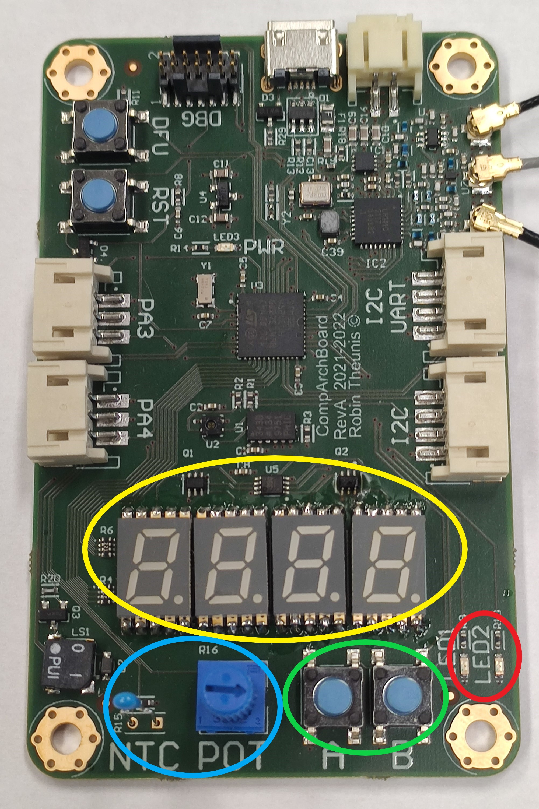
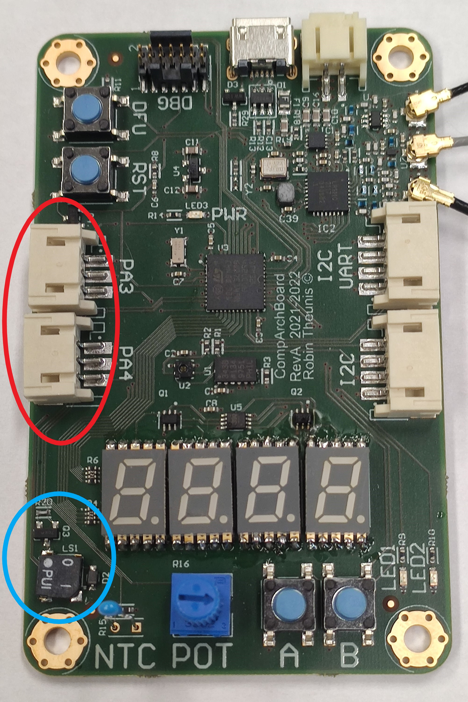
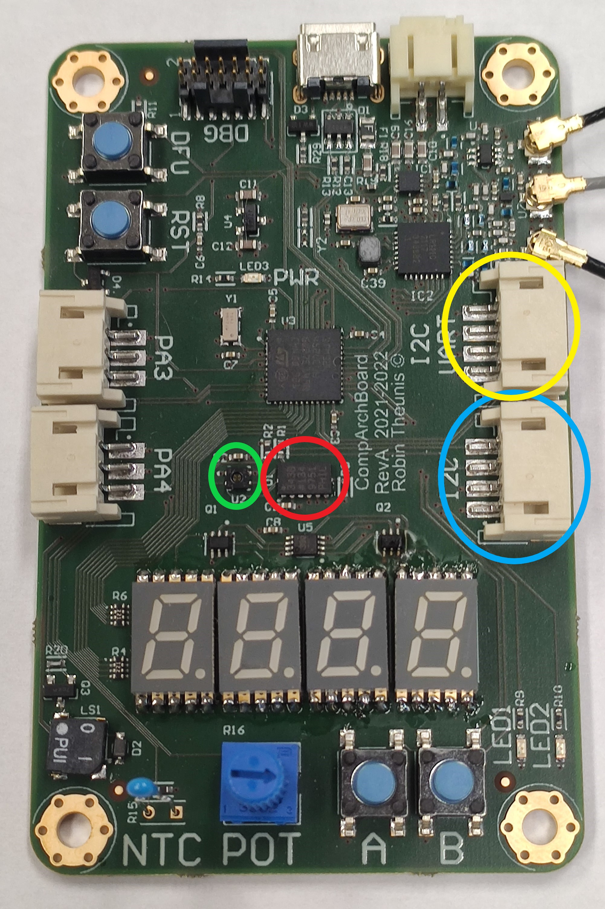
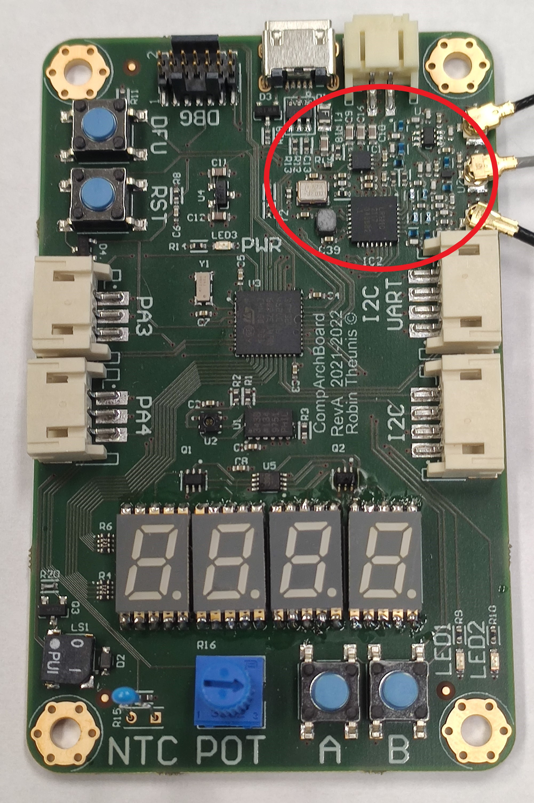
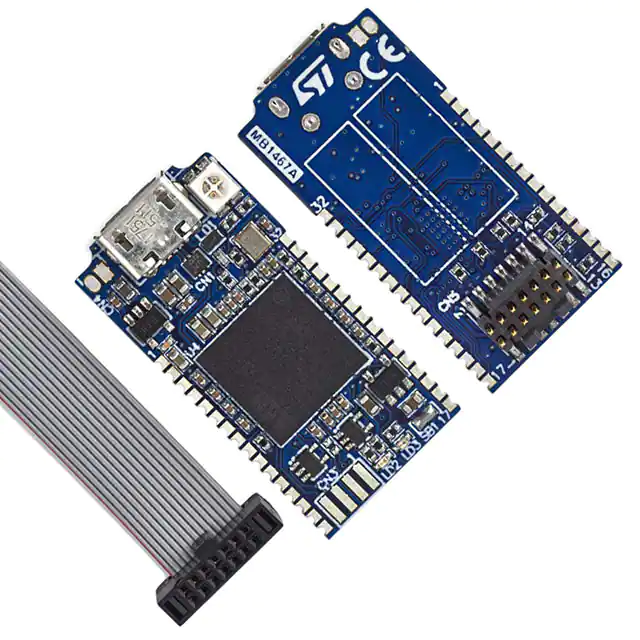
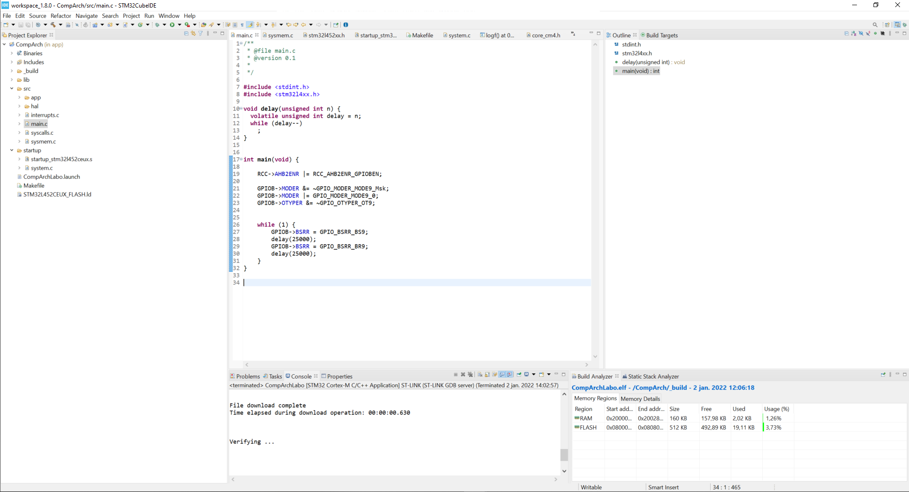
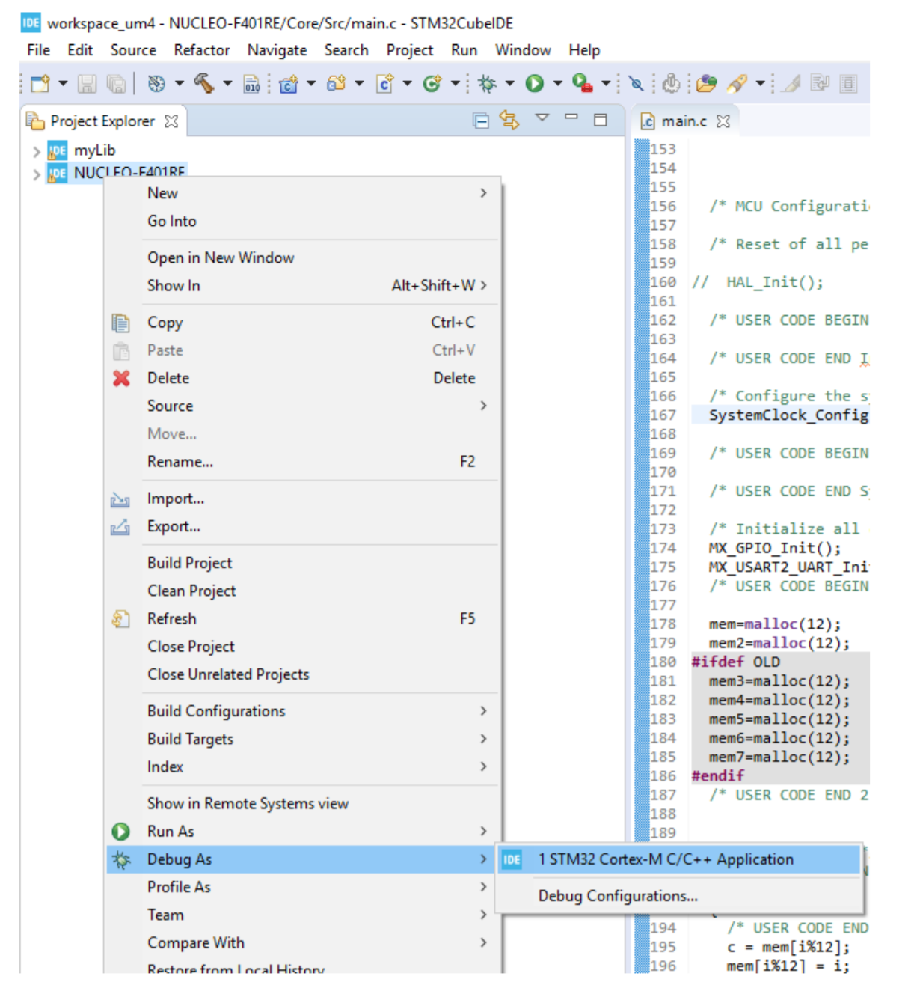
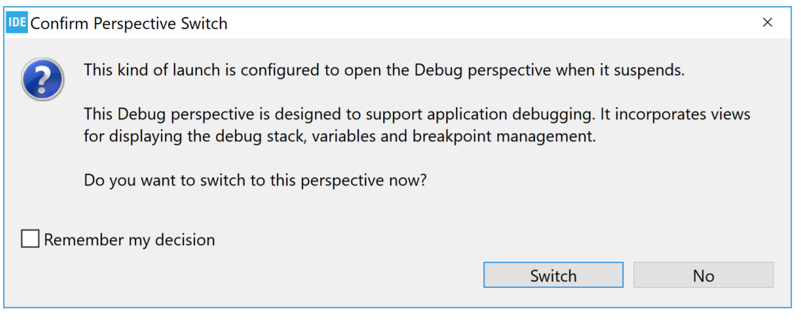
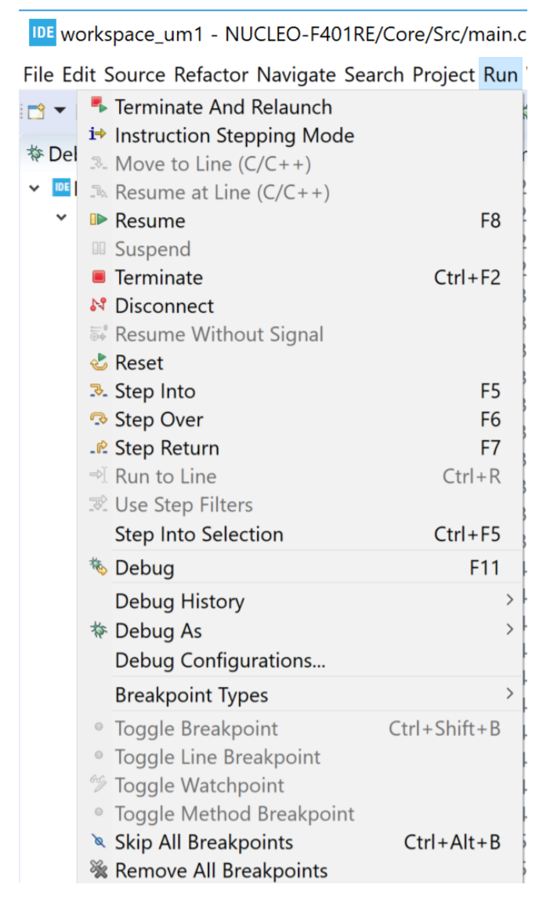
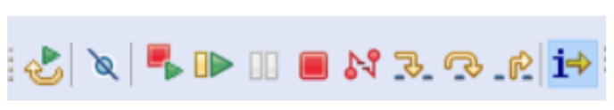

# Lab 0: De omgeving

## Opzet

In dit labo maak je kennis met de ontwikkelomgeving voor de microcontroller en de bijhorden software flow.

## STM32L4

Het labo is opgebouwd met de STM32L452 microcontroller van STMicroelectronics. Deze microcontroller komt uit de STM32L4 lijn, deze lijn van controllers zijn speciaal gemaakt voor ultra low power toepassingen. Daarvoor heeft de microcontroller allerlei geavanveerde pereferie ingebouwd welke oftwel het verbruik optimaliseren of deze zo minimaal mogelijk energie verbruiken. 

Een aantal belangrijke kenmerken van de microcontroller:
* ARM Cortex M4F processor met een maximale kloksnelheid van 80 MHz
* 512 kiB flash
* 160 kiB SRAM
* ADC/DAC
* 5 UARTs blokken
* 3 SPIs blokken en ook een QSPI blok
* 4 I2Cs blokken
* 7 Timers
* USB en CAN
* SDIO (SD kaart interface)
* Watchdogs
* Random Number Generator
* 2 DMA controllers

Zoals men kan zien, zitten deze microcontrollers boordevol features en mogelijkheden. Daardoor zijn deze type van microcontrollers zeer veelzijdig in te zetten, van ultra low power sensoren om de groei van planten te optimaliseren tot intiligenten voertuig monitoring om ongevallen te vermeiden. 

In onderstaand diagramma geeft blokschematisch weer hoe de microcontroller die gebruikt wordt in het labo van binnenuit ziet. 

In het diagramma kunnen we de volgende onderdelen herkennen:

* De processor
* Het geheugen
* De perferie, UARTs/SPIs/...
* De bussen die alles met elkaar verbinden

### Bussen

Omwillen van de complexiteit en mogelijkheden tot optimalisatie van zijn er verschillende bussen gebruikt op de microcontroller.

AHB(Arm High performance Bus) bus-matrix is verbind de processor met het Flash en RAM geheugen en de AHB1 en AHB2 bussen. Ook heeft deze connecties met de DMA controllers en de QSPI interface. In deze bus-matrix zijn de processor en de DMA controllers de master en zijn het geheugen samen met de AHB1 en AHB2 bussen de slaves. Elke de masters kunnen informatie opvragen bij de slaves. 

De AHB1 en AHB2 bussen verbinden de peferie blokken met met de busmatrix. Dit kan direct zijn zoals de GPIO peferie of indirect via een AHB-to-APB bus omvormer. De meeste hardware blokken zijn dan ook verbonden met de een APB(Arm perhifial bus) bus.

Om straks een hardware blok te gebruiken moet daar meestal eerst een intern klok voor geactiveerd worden. Om te weten welke klok dit is, is het diagramma een handige tool omdat deze klokken gegroepeert zijn per bus waarmee deze hardware blokken zijn verbonden. 

### ARM Cortex M4F

De ARM Cortex M4 processor gebruikt de ARMv7E-M architetuur en ondersteunt de volledige Thumb-1 en Thumb-2 instructies sets. 

Verder bevat de Cortex M4 de volgende features:
* 32-bit single-cycle hardware integer vermenigvulder met 32-bit of 64-bit resultaat, met of zonder teken, add off subtract na de vermenigvuldiging.
* 32-bit single-cycle MAC(multiply accumulate).
* 32-bit hardware integer deling (2–12 cycles)
* Saturatie wiskunde support
* DSP extenties: 
    * Single cycle 16/32-bit MAC, 
    * single cycle dual 16-bit MAC, 
    * 8/16-bit SIMD instructies
* 1 to 240 interrupts, plus NMI
* 12 cycle interrupt latency
* floating-point unit (FPU): alleen single-precision, IEEE-754 compliant
* Memory protection unit (MPU)

## Software tools

Voor het labo gebruiken we de STM32CubeIDE versie 1.8.0. Deze tool is te vinden op: https://www.st.com/en/development-tools/stm32cubeide.html

In het labo gebruiken we rechtstreeks de hardware registers in plaats van de HAL bibliotheek. Het template project dat gebruikt moet worden voor het labo bevat de juiste initilasatie en configuratie. 

### Make & Makefiles

Make is een computerprogramma dat als hulpmiddel kan worden gebruikt om grote applicaties automatisch te bouwen voor softwareontwikkeling. De computerbestanden die instructies bevatten voor make worden makefiles genoemd. Make houdt bij welke bestanden zijn gewijzigd sinds de laatste maal dat een project was gebouwd en start de compiler enkel voor deze broncodebestanden en de bestanden die afhankelijk zijn van deze bestanden.

Het template project gebruikt Makefiles voor configuratie van de compelatie. In deze MakeFile staat ook welke files gecompileerd moeten worden tot één werkende applicatie. Als men het pad van het C bestand toevoegt aan C_SOURCES wordt deze mee genomen in de compelatie. Een map toevoegen aan C_INCLUDES maakt de .h files beschikbaar voor include statements.

    ######################################
    # source
    ######################################
    # C sources
    C_SOURCES =	startup/system.c \
                src/main.c \
                src/interrupts.c \
                src/syscalls.c \
                src/sysmem.c 

    # C includes
    C_INCLUDES =	-Isrc \
                    -Ilib \
                    -Ilib/cmsis 

De Makefile bevat ook de configuratie over voor welke archectuur de C code moet worden gecompiled. De **-mcpu=cortex-m4** flag zegt tegen de C compiler dat het over een ARM Cortex M4 processor gaat, de **-mfpu=fpv4-sp-d16** maakt aan de compiler duidelijk dat de microcontroller een floating point unit heeft. 

    #######################################
    # CFLAGS
    #######################################
    CPU = -mcpu=cortex-m4
    FPU = -mfpu=fpv4-sp-d16
    FLOAT-ABI = -mfloat-abi=hard
    MCU = $(CPU) -mthumb $(FPU) $(FLOAT-ABI)

## Hardware tools

Voor dit labo wordt er een speciaal ontworpen bordje ter beschikkinggesteld. Dit bevat alle nodige rand componenten om de microcontroller te laten werken en de verschillende opgaves mee te maken en testen.

### Microcontroller

In de rode cirkel op bovenstaande foto bevindt zich de mircocontroller. Dit is een STM32L452 in een QFN behuizing. 

De blauwe cirkel bevat de RESET knop waarmee de processor gereset kan worden. Ook is er een DFU knopje, hiermee kan de microcontroller in USB bootloader modus worden geconfigureerd. Om in deze modus te geraken moet men de DFU knop inhouden en dan kort de RESET knop indrukken. 

De debug verbinding bevindt zich in de groene cirkel. Hiermee wordt via het flat kabeltje het testbordje verbonden met de debugger. 

Via de USB connector of de JST PH stekker in de gele cirkel kan het testbordje worden gevoed. De JST PH connector ondersteunt een 1 cell Li-Ion batterij. Op het bordje zit een batterij lader ingebouwd welke via de USB poort de Li-Ion batterij geladen kan worden.

### UI

In de rode cirkel bevinden zich twee LEDs welke kunnen aangestuurd worden door de microcontroller.

| Functie | GPIO | Pin | 
| ------- | ---- | --- |
| LED1 | GPIOB | Pin 9 |
| LED2 | GPIOC | Pin 13 |

In de groene cirkel staan twee knopjes.

| Functie | GPIO | Pin | 
| ------- | ---- | --- |
| Button A | GPIOB | Pin 13 |
| Button B | GPIOB | Pin 14 |

In de blauwe cirkel staan een 10 kOhm NTC weerstand en een Potention meter. Deze twee zijn verbonden met een ADC input van de microcontroller.

| Functie | GPIO | Pin |  ADC Kanaal |
| ------- | ---- | --- | ----------- |
| Potentionmeter | GPIOA | Pin 1 | CH5 |
| NTC weerstand  | GPIOA | Pin 0 | CH6 |

Het 7 segment scherm in de gele cirkel wordt gemultiplext. Via de volgende pinnen kan het 7 segment scherm worden aangestuurd:

| Functie | GPIO | Pin |
| ------- | ---- | --- |
| Disp 0 | GPIOA | Pin 8 |
| Disp 1 | GPIOA | Pin 15 | 
| Seg A | GPIOB | Pin 0 | 
| Seg B | GPIOA | Pin 7 | 
| Seg C | GPIOA | Pin 5 | 
| Seg D | GPIOB | Pin 12 | 
| Seg E | GPIOB | Pin 15 | 
| Seg F | GPIOB | Pin 1 | 
| Seg G | GPIOB | Pin 2 | 
| Seg DP | GPIOA | Pin 6 | 

### Buzzer & IO

De blauwe cirkel bevat de buzzer. Deze Buzzer moet via een 50% duty cycle PWM signaal worden aangestuurd.

| Functie | GPIO | Pin |
| ------- | ---- | --- |
| Buzzer | GPIOB | Pin 8 |

In de rode cirkel zijn twee aansluitingen voorzien die verbonding zijn met PA3 en PA4, dit zijn twee pinnen die verbonden zijn met ADC kanalen en de twee DAC kanalen.

| Functie | GPIO | Pin |  ADC Kanaal |
| ------- | ---- | --- | ----------- |
| PA3 | GPIOA | Pin 1 | CH8 |
| PA4  | GPIOA | Pin 0 | CH9 |

### I2C & UART

Op de PCB zijn enkele I2C apparaten gemonteerd:
* Accelerometer, ADXL343BCCZ
* Temperatuurs en luchtvochtigheidssensor, ENS210-LQFM
* Li-ION batterij lader, MP2667GG

Ook is deze I2C bus uitbreidbaar via de connector die omcirkeld is in het blauw.

De Connector die omcirkeld is in het geel is een extra I2C of UART poort.

| Functie | GPIO | Pin |
| ------- | ---- | --- |
| SCL | GPIOB | Pin 6 | 
| SDA | GPIOB | Pin 7 |

De extensie connector gebruik de volgende pinnen. 

| Functie | GPIO | Pin | 
| ------- | ---- | --- | 
| PB11 | GPIOB | Pin 11 |
| PB10 | GPIOB | Pin 10 |

### LR1110

Ook op het bordje staat een LR1110 van Semtech. Dit is een multifunctionele radio chip. Deze is verbonden met de SPI poort van de microcontroller. Deze radio heeft de volgende features:

* 868 MHz zendontvanger, met LORA ondersteuning
* 2.4 GHZ Wifi scanner, om te detecteren welke netwerken in de buurt zijn.
* snapshot GPS ontvanger, welke voor een paar seconden GPS signal ontvangt en deze dan kan doorsturen via lora naar een centrale processor om dan een positie te kunnen berekenen. 

De LR1110 is als volgt verbonden met de microcontroller

| Functie | GPIO | Pin | 
| ------- | ---- | --- | 
| SCK  | GPIOB | Pin 3 |
| MISO | GPIOB | Pin 4 |
| MOSI | GPIOB | Pin 5 |
| NSS | GPIOH | Pin 1 |
| BUSY | GPIOC | Pin 15 |
| IRQ | GPIOH | Pin 0 |
| RESET | GPIOA | Pin 2 |

### Debugger

De debugger die gebruiken om het bordje te programmeren is een STLINK-V3MINI. Met bijgeleverde flatcable kan je de debugger met de het testbordje verbinden.

## Opdracht Compile and Debug

1. Laad het project in de STM32CubeIDE
2. Compile het project
3. Stel de debugger in
4. Debug het project op de microcontroller

### Project importeren

Vanuit de documentatie van ST, moet je de volgende stappen ondernemen:

1. File > New > Makefile project with Existing Code
    1. Give a name
    2. Point to the project location
    3. Select MCU ARM GCC
2. OK - you will now have to make sure that the makefile is found by the build system.
    1. Hint, check: Project Properties > C/C++ Build > Builder Settings > Build directory
3. Once you have a working makefile you probably want to debug as well...
4. To make debug work the debugger integration needs to know which MCU you are targeting. Because of a known issue in CubeIDE 1.6.0, you have to perform a little stunt:
    1. Project Properties > C/C++ Build > Builder Settings > Check "Generate Makefiles automatically".
    2. Click Apply
    3. WARNING: Do NOT build your project until step 7 is finished!! If you do, the managed build system will overwrite your makefiles!
    4. This will expose a hidden GUI:
    5. Project Properties > C/C++ Build > Settings > Tool Settings > MCU Settings > Select.
        1. Browse for your MCU select it and click Apply.
    6. Go back to Project Properties > C/C++ Build > Builder Settings > and Uncheck "Generate Makefiles automatically".
    7. Click Apply.
5. All done. If you create a debug config now you should be able to debug the target... If you instead tried to launch the debug session without performing step 4 you will get tons of errors messages...

Als bovenstaande operatie geslaag is, zou je het volgende moeten zien.

### Compilen

Zie 📌***USER-GUIDE-CUBEIDE62*** in de handleiding voor een uitgebreide uitleg.

De code kan worden gecompiled doormiddel van op het [build] icoontje te klikken in de taakbalk of in het menu naar [Project] -> [Build project].

### Debuggen

Zie 📌***USER-GUIDE-CUBEIDE126*** in de handleiding voor een uitgebreide uitleg.

Men kan de debugger starten via volgende menu items, 

of

Voor het debuggen programmeert de IDE de juiste firmware in de microcontroller en laad deze de nodig configuratie. 

Tijdens het debuggen kan de volgende melding komen.

Het beste is als je "remember my decision" aan vinkt en op "switch" klikt. Dan staat de IDE altijd in de juiste instelling.

Met de volgende knoppen kan je de debugger controleren. In de 📌***USER-GUIDE-CUBEIDE*** worden deze verschillende actie grondig uitgelegd.

De debugger heeft nog verschillende mogelijkheden:

* Bekijken van registers, 📌***USER-GUIDE-CUBEIDE179***, Special Function Registers (SFRs)
* Breakpoints, 📌***USER-GUIDE-CUBEIDE146***
* Dissamebly view, 📌***USER-GUIDE-CUBEIDE62***

