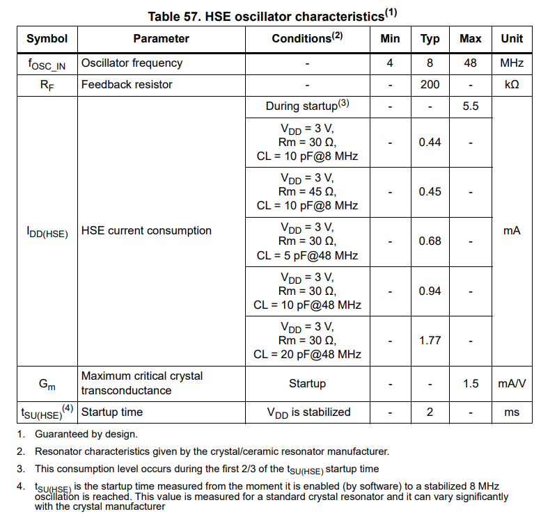
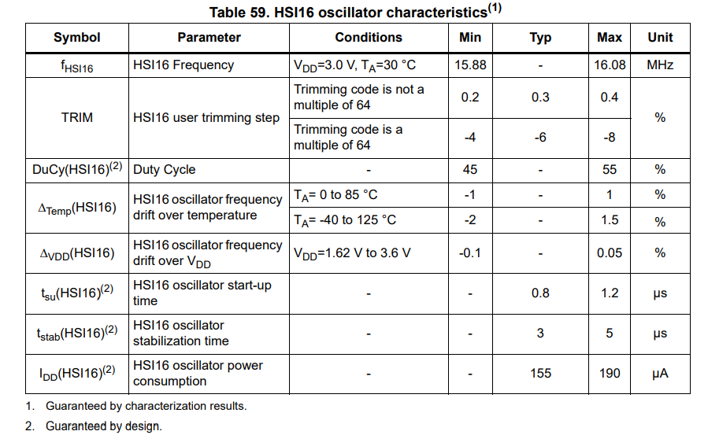
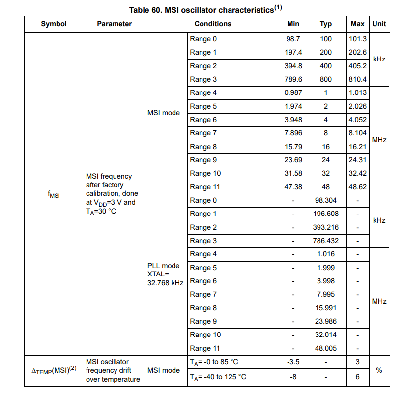
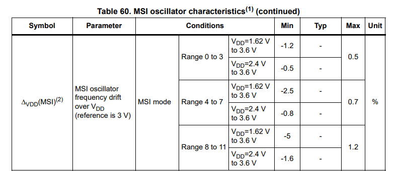
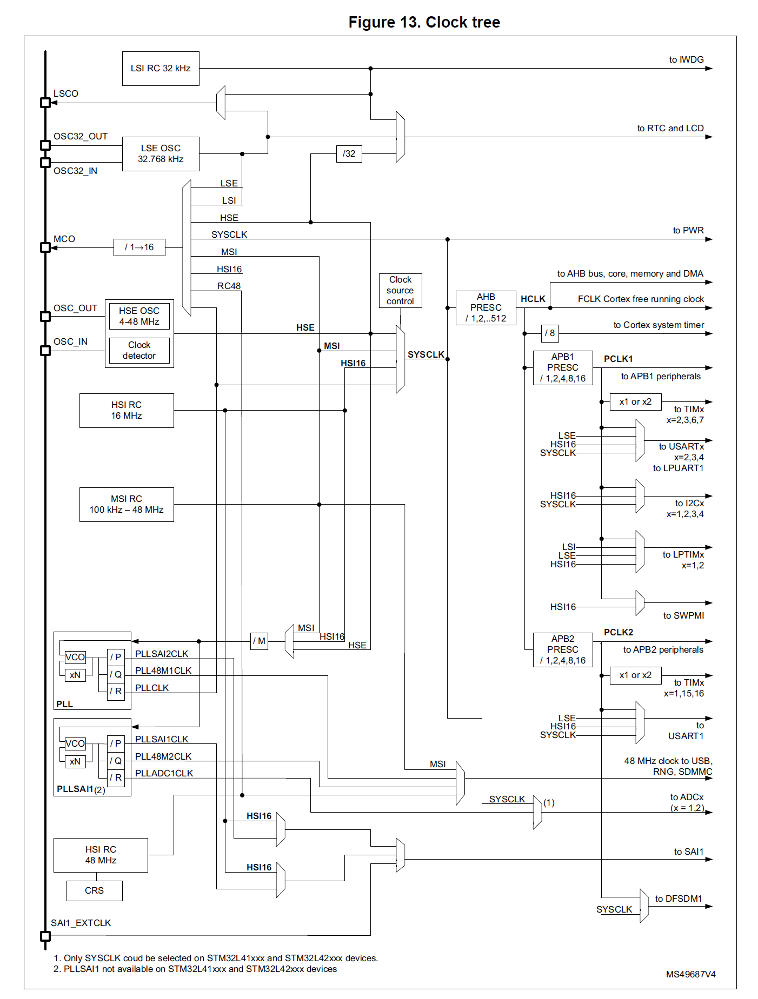
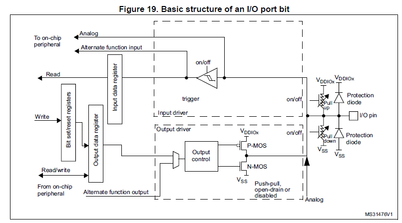

# Lab 1: De knipperde led

## Opzet

Het doel van dit labo is om kennis te maken met de basis hardware blokken van een STM32L4, deze zijn de RCC en GPIO elementen. 

## RCC

📌 **RM150** 

De RCC of Reset and Clock Controller is een van de meeste belangrijke element in deze microcontroller. Deze blok controlleert de klok en reset van de processor en andere periferie. 

### Reset 

Deze blok configureerd hoe de microcontroller moet reageren op verschillende reset signalen en kan ook bepaalde periferie resetten.  

Via het RCC_CSR register kan de processor opvragen hoe de microcontroller gereset geweest is. Dit kan via
* Een externe reset puls op de RST pin
* Een brown-out reset. Dit wilt zeggen dat de spanning onder een bepaald niveau is geweest en de controller voor alle veiligheid zichzelf gereset heeft omdat het niet meer kan garanderen dat alle intern flipflops nog de correct toestand hebben.
* Een software reset
* Watchdog resets
* ...

### Clocks

Een kenmerk van moderne microcontrollers is dat deze veel opties hebben om hun klok te bepalen. Deze klok bepaal hoe snel de processor de programma code uitvoert en hoe snel bepaalde periferie werkt.

Voor de microcontroller die in dit labo is gebruikt zijn er een 4 tal mogelijkheden om intern de processor van een klok signaal te voorzien.

* HSI16 oscillator, een vaste 16 MHZ RC oscillator
* MSI oscillator, een variable interne oscillator van 100 kHz tot 48 MHz
* HSE oscillator, deze oscillator heeft een extern klok kristal nodig als tijd referentie
* Phase locked loop

Vanuit reset is de microcontroller geconfigureert om de MSI oscillator te gebruiken. Deze start met een klok frequentie van 4 MHz.

De maximale klok frequentie van processor is 80 MHz. Om deze klok frequentie te halen is de PLL nodig om de frequentie van de inkomende klok aan te passen. Met de juiste instelling kan men van 1 vast kristal bijna alle frequentie maken met de PLL blok die men zou kunnen nodig hebben. 

Afhankelijk van de toepassing en hardware specificaties is 1 van de 4 mogelijkheden de beste. Klokken die de HSE al referentie gebruiken zijn van nauwkeurigere en stabieler door het gebruik van het kristal. Deze oscillator gaat wel meer vermogen verbruiken en is dus minder geschikt voor toepassingen waar een lagere verbruik nodig is. Deze oscillator heeft ook meer tijd nodig om op te starten. In toepassingen waar de oscillator zeer frequent van sleep mode naar active mode springt kan die een vrij significatie overhead creëren en in het slechte geval de winst in vermogengebruik door de sleep mode te niet doen.  

Uit bovenstaande tabel kan met zien dat de HSE ongeveer 2 ms nodig heeft om op te starten en ook deze oscillator een hoog verbruik heeft.

De twee interne oscillatoren HSI16 en MSI hebben ook elk hun eigen toepassing. 

De specificaties van de HSI16 oscillator tonen dat deze in vergelijking met de HSE oscillator sneller opstart en ook minder verbruikt. Het nadeel van deze oscillator is de frequentie tolerantie of nauwkeurigheid. Deze is minder goed als een kristal. Een normaal kristal heeft een frequentie tolerantie van ongeveer 50 ppm. Dit wilt zeggen dat de frequentie 50 miljoenste kan afwijken door voornamelijk temperatuur en productie variaties. De HSI16 gebruikt een intern RC netwerk en in de karakterstieken kan men zien dat deze afwijking groter is. Bij de HSI16 kan dit gaat tot een 1%. Deze afwijking is nog laag genoeg om simpele asynchrone communicatie te laten slagen. Complexere communicatie zoals USB heeft een nauwkeuriger referentie nodig.

De MSI oscillator offert stabiliteit op voor nauwkeurigheid. In de specificaties zien we dat deze on nauwkeurigheid oploopt tot een aantal procenten voor voedingsspanning en temperatuursvariaties. 

Daardoor is de MSI veel minder geschikt in toepassingen waar een correcte tijdsreferentie nodig. Maar de MSI oscillator heeft 1 speciale modi waarover de andere niet beschiken en dan is de LSE-PLL modus.

In sommige applicatie is het nodig om een absolute tijd te kunnen, dus jaar maand dag uur minuten en seconden. Daarvoor heeft de microcontroller een RTC ingebouwd. Deze RTC blok houd de tijd bij. Om deze nauwkeurige te kunnen volgen gebruikt men meestal een 32.768 kHz kristal welke voor de LSE oscillator als referentie. Het voordeel aan d 32.768 kHz oscillatoren ten opzicht van kristal oscillatoren die op enkele MHz werken is dat deze zeer weinig verbruiken, dit kan een factor 800x minder zijn. 

In een toepassing waar een accurate tijd moet worden bijgehouden en waar deze ook niet te veel mag verbruiken is het een optie om de MSI oscillator in LSE-PLL modus te gebruiken. In deze modus gaat de MSI automatisch zijn frequentie aanpassen zodat deze in een exacte interger veelvoud is van de 32.768 kHz.

In het labo gebruiken we de MSI oscillator in LSE-PLL modus. In deze situatie gaat de MSI 48.00512 MHz genereteren of 1465 * 32.768 kHz.

Deze configuratie vind je in:.....

### Clock tree

Omwille van de flexibiliteit heeft de microcontroller die we gebruiken ook een uitgebreide "clock tree" of klokboom. Voor verschillende pereferie kunnen we kiezen welke klok we willen gebruiken. Welke klokken dit juist zijn voor een bepaalde hardware blok hangt af van de op welke bus deze verbonden is en wat voor type pereferie deze blok is.

Om een pereferie blok aan te zetten moet me in de RCC configuratie die bepaalde klok activeren.

Voorbeelden

* Activeren GPIO

        // Activeren klok
        RCC->AHB2ENR |= RCC_AHB2ENR_GPIOHEN_Msk;

* Activeren USART2 en HSI16 gebruiken

        // Selecteren van HSI16
        RCC->CCIPR &= ~RCC_CCIPR_USART2SEL_0;
        RCC->CCIPR |= RCC_CCIPR_USART2SEL_1;

        // Activeren klok
        RCC->APB1ENR1 |= RCC_APB1ENR1_USART2EN_Msk;

### Belangrijke registers

| Register   | Doel  | Info  |
|---|---|---|
| AHB1ENR | Activatie TSC/CRC/FLASH/DMA2/DMA1  | 📌 ***RM216*** |
| AHB2ENR | Activatie RNG/ADC/GPIOA..H  | 📌 ***RM218***   |
| AHB3ENR | Activatie QSPI  | 📌 ***RM219***   |
| APB1ENR1 | Activatie LPTIM1/OPAMP/DAC1/PWR/USB/CAN1/I2C3/I2C2 I2C1/UART4/USART3/USART2/SPI3/SPI2/WWDG/RTC/LCD/TIM7/TIM6/TIM3/TIM2  |  📌 ***RM220***  |
| APB1ENR2 | Activatie LPTIM2/I2C4/LPUART1 | 📌 ***RM222***  |
| APB2ENR |  Activatie DFSDM1/SAI1/TIM16/TIM15/USART1/SPI1/TIM1/SDMMC1 | 📌  ***RM224***  |
| CCIPR | Selectie klok ADC/CLK48/SAI1/LPTIM2/LPTIM1/I2C3/I2C2/I2C1/LPUART/UART4 USART3/USART2/USART1  |  📌 ***RM234*** |

## GPIO

📌 **RM258** 

De GPIO blokken op een STM32 bevatten een aantal werkingsmodi. Deze zijn als volgt:
* Input
* Output
* Analoog
* Alternate function output

Deze modi kunnen per pin in de GPIO afzonderlijk worden ingesteld. 

Bij een GPIO pin als input kan men de ingang nog verder configureren. Men kan kiezen voor een floating input, een pull-up weerstand of een pull-down weerstand. Dit afhankelijk van de toepassing.

Bij een GPIO pin als output heeft men de keuze voor een Push-Pull uitgang, of een opendrain uitgang. 

Alternate function wilt zeggen dat deze IO pin wordt bestuurd door een andere hardware blok zoals bijvoorbeeld de UART of I2C. 

Als de GPIO pin als "analoog" staat ingesteld dat schakelt de microcontroller de pull up en pull down weerstand uit, en ook de input buffer en output transistoren. In deze modi verbruikt de GPIO pin het minste. Dit wordt toegepast als men de pin wilt gebruiken voor de ADC of DAC, of als men zo min mogelijk energie wilt verbruiken.

Als de microcontroller opstart staan alle pinnen in de analoge toestand.

### Configuratie

Via het ****GPIOx_MODER** register kan men bepalen in welke modi de pin werkt. Voor elke pin zijn er twee bits reserveerd in dit 32 bit registers. 

* 00: Digitale ingang
* 01: Digitale uitgang
* 10: Alternate function modus
* 11: Analoge modus

In het **GPIOx_OTYPER** register bepaalt men de type van uitgang. Men kan kiezen uit een Push-Pull modus, waar in zowel de P-MOS als de N-MOS worden aangestuurd, of een Open-Drain. In de laatste wordt enkel de N-MOS aangestuurd. Men zegt in Push-Pull modus dat de uitgang zowel stroom kan sinken als sourcen. Met andere woorden bij een 1 zal de uitgang via de P-MOS actief aan de VDD worden gekoppeld, en bij een 0 zal de uitgang via de N-MOS actief aan de GND worden gekoppeld.

Bij een opendrain gebeurt enkel dat laatste. Daar betekend een 1 geen actieve verbinding met de GND en een 0 betekend een laag ohmige verbinding.

Met het **GPIOx_OSPEEDR** register kan met de snelheid van de uitgang bepalen. Deze setting regelt de maximum stroom die een uitgang kan sturen. Hoe hoger deze setting hoe sneller de uitgang de van een 0 naar 1 en vicaversa kan gaan. Deze snelheid wordt ook bepaald door de hoeveelheid parasitaire capaciteit er op deze uitgang gekoppeld is. 

Voor simpele digitale signalen komt men met "Low speed" of "Medium speed" toe. Voor snelle signalen zoals later SPI kan het zijn dat men naar "High speed" moet gaan. 

Het **GPIOx_PUPDR** register configureert de Pull-Up of Pull-Down weerstand voor de ingang of uitgang.

Voorbeeld:

    // GPIOB pin 9 configureren als output
    GPIOB->MODER &= ~GPIO_MODER_MODE9_Msk;
    GPIOB->MODER |= GPIO_MODER_MODE9_0;
    
    // GPIOB pin 9 configureren als Push Pull uitgang
    GPIOB->OTYPER &= ~GPIO_OTYPER_OT9;

### Aansturing

Om het niveau van de pin te weten, kan men het **GPIOx_IDR** register uitlezen. Bit 0 in dit registers komt overeen met GPIO Pin 0, 1 met 1, en zo verder.

Als de GPIO als output ingesteld staat, bepaald de waarde van **GPIOx_ODR** de toestand van de pin. Een 0 voor een bepaalde bit betekend een laag signaal op die bepaalde output en een 1 betekend een hoog signaal.

Met **GPIOx_BSRR** kan men bepaalde bits setten en resetten. Door een 1 te schrijven op de RESET bit van een bepaalde GPIO maakt men deze laag, door een 1 te schrijven op de SET bit maakt men deze hoog. 

Voorbeeld:

    // Pin hoog zetten
    GPIOB->ODR |= GPIO_ODR_OD9;

    // Pin laag zetten
    GPIOB->ODR &= ~GPIO_ODR_OD9;

    // Pin hoog zetten via BSRR
    GPIOB->BSRR = GPIO_BSRR_BS9;

    // Pin laag zetten via BSRR
    GPIOB->BSRR = GPIO_BSRR_BR9;

###  Belangrijke registers

| Register   | Doel  | Info  |
|---|---|---|
| GPIOx_MODER | Modi configuratie  |  📌 ***RM267*** |
| GPIOx_OTYPER | Output type configuratie | 📌 ***RM268***   |
| GPIOx_OSPEEDR | Output snelheid configuratie  |📌 ***RM268***   |
| GPIOx_PUPDR | Pullup/Pulldown configuratie  |📌 ***RM268***  |
| GPIOx_IDR | Input data register | 📌 ***RM269***  |
| GPIOx_ODR | Output data register | 📌 ***RM269***  |
| GPIOx_BSRR | Bit set reset register | 📌 ***RM270*** |
| GPIOx_AFRL | Alternate function configuratie 0 tot 7 | 📌 ***RM271*** |
| GPIOx_AFRH | Alternate function configuratie 8 tot 15 | 📌 ***RM272*** |

## Implementatie

Voor bijna elke handware blok in de STM32L4 ga je altijd de volgende stappen moeten ondernemen om deze te configureren

1. De klokboom correct instellen indien nodig.
2. In het RCC registers de gewenste pereferie aanzetten.
3. De pereferie configureren.

## Opdracht

1. Schrijf een C programma om de twee leds (LED1 en LED2) te laten knipperen. Als we drukknop A induwen knipperen ze snel, als we op drukknop B induwen knipperen ze traag. 

2. Bekijk met de debugger de disassembly van het hoofd programma en bespreek de basis blokken die je ziet. Identificeer jouw wacht lus, het inlezen en beslissingsstructuur van de knoppen en het aansturen van de leds.

3. Bespreek verschil tussen het gebruik ODR en BSRR? Hoe vertaald zich dat in de disassembly?

### **LED GPIOs**

* LED1 is aangesloten op 
* LED2 is aangesloten op

Als de GPIO PIN hoog is lichten de leds op.

### **Button GPIOs**

* Button A is aangesloten op 
* Button B is aangesloten op

Als op de button wordt gedrukt dan wordt deze GPIO PIN laag getrokken. Hier moet je de PULL-UP weerstand voor aanzetten. 