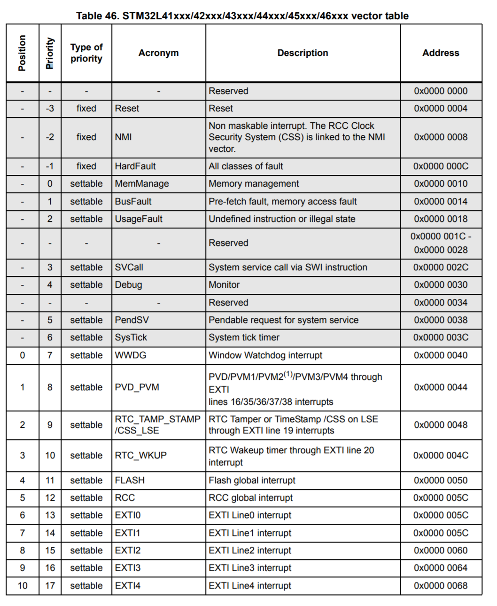

# Lab 2: De klok

## Opzet

Het doel van dit labo is om de interrupt controller van de Cortex M4 te leren gebruiken. Dit aan de hand van de systick timer en de external interrupts.

## Exceptions

De ARM processor in de microcontroller gebruikt het ARM Exception model. Een exception wordt in de ARM specificatie als volgt gedefineerd: "a condition that changes the normal flow of control in a program".

Een exception heeft de volgende informatie:

* Een Exception nummer, een uniek nummer welke de exceptie identificeert beginnend van 1. Dit getal wordt ook gebruik om het adres naar de routine voor deze exceptie te selecteren uit de vector tabel. 
* Prioriteits niveau van de exceptie. Als twee excepties tegelijker tijd komen dan wordt afhankelijk van dit getal beslist welke van de twee eerste moet worden uitgevoerd. Een lagere prioriteits niveau wordt eerst uitgevoerd. Als twee excepties met dezelfde prioriteits niveau tegelijkertijd binnenkomen dan wordt degene met het laagste exceptie getal eerst uitgevoerd.
* Synchroon of Asynchroon. Als een exceptie synchroon is, wordt deze onmiddelijk na een instructie uitgevoerd. Bijvoorbeeld de SVCall exceptie of een divide by zero exceptie. Asynchrone excepties zijn bijvoorbeeld komen van een bepaalde blok hardware.

Een interrupt is een bepaalde type van asynchrone exception. 

### Intern excepties

* Reset, wanneer de microcontroller uit reset komt wordt deze routine uitgevoerd. Deze routine gaat dan ook "main()" oproepen.
* Non Maskable Interrupt, zoals de naam het al zegt kan deze exceptie niet worden uitgezet. Deze wordt opgeroepen als er een fout optreed in als er een fout optreed in andere exceptie routines. Naast de Reset exceptie heeft deze de tweede hoogste prioriteit. 
* HardFault, MemManage, BusFault, UsageFault, deze excepties worden uitgevoerd als er een fout optreed in het programma, zoals een divide-by-zero of men slecht geheugen aanspreekt. 
* SVCall is een exceptie routine die vanuit de "svc" instructie wordt uitgevoerd. Deze interrupt wordt vaak gebruikt in operating systems en RTOS systemen.
* PendSV exceptie wordt gebruik in OS en RTOS systemen om een context switch te maken.
* Systick exceptie wordt opgeroepen wanneer de intern system-timer op 0 komt.

### Extern excepties

Extern excepties of interrupt wordt genereeert uit de hardware. Deze excepties starten vanaf nummer 16. 

### Implementatie

In de file "startup_stm32l452ceux.s" wordt de vector tabel aangemaakt. De naam **isr_vector** geeft aan in het assembly bestand waar deze vector table in de FLASH van de microcontroller wordt geplaatst. In de linker file kan je zien dat deze aan het begin van het flash geheugen wordt geplaatst. 

    .section .isr_vector,"a",%progbits
    .type g_pfnVectors, %object
    .size g_pfnVectors, .-g_pfnVectors

    g_pfnVectors:
        .word   _estack
        .word   Reset_Handler
        .word   NMI_Handler
        .word   HardFault_Handler
        .word	MemManage_Handler
        .word	BusFault_Handler
        .word	UsageFault_Handler
        .word	0
        .word	0
        .word	0
        .word	0
        .word	SVC_Handler
        .word	DebugMon_Handler
        .word	0
        .word	PendSV_Handler
        .word	SysTick_Handler
        .word	WWDG_IRQHandler          			/* Window Watchdog interrupt                                           */
        .word	PVD_PVM_IRQHandler       			/* PVD through EXTI line detection                                     */
        .word	RTC_TAMP_STAMP_IRQHandler			/* Tamper and TimeStamp interrupts                                     */
        .word	RTC_WKUP_IRQHandler      			/* RTC Tamper or TimeStamp /CSS on LSE through EXTI line 19 interrupts */
        .word	FLASH_IRQHandler         			/* Flash global interrupt                                              */

Omdat zowel de hardware als de C compiler de **ARM Architecture Procedure Calling Standard (AAPCS)** implementeert kunnen deze interrupt routines als gewone C functies worden geprogrammeerd zonder dat hiervoor assembly nodig is. Deze standaard legt uit hoe registers van de processors moeten bewaard worden waneer deze worden opgeroepen van uit een andere functie. Wanneer een exceptie wordt opgeroepen gaat de processor op dezelfde manier die registers bewaren op de stack.

Voorbeeld een exceptie routine voor de Systick:

    // Systick handler
    void SysTick_Handler(void){
        tick++;
    }

## NVIC

📌 ***PM210*** en 📌***RM320***

De NVIC of Nested Vectored Interrupt Controller in de STM32L452 beheerd alle extern exceptie of interrupts. 

De NVIC bevat 6 type registers
* **ISERx**, Enable set register, door een 1 te schrijven op de juiste plaats in dit register kan je een interrupt aanzetten
* **ICERx**, Enable clear register, door een 1 te schrijven op een bepaalde plaats kan je een interrupt uitzetten
* **ISPRx**, Pending set register, maakt een bepaalde interrupt pending, als deze interrupt de hoogste prioriteit heeft wordt deze dan uitgevoerd. 
* **ICPRx**, Pending clear register, maakt een interrupt niet meer pending.
* **IABRx**, Active register, geeft aan welke interrupt actief is.
* **IPRx**, Priority register, configureert de prioriteit van de interrupt.

In de programming guide op pagina 📌***PM210*** vind je een uitgebreide beschrijving van de verschillende registers. Deze documentatie is generiek over de verschillende microcontrollers, in de reference handleiding op pagina 📌***RM320*** staat de juiste invulling voor de gebruikt microcontroller.

In de microcontroller die bij dit labo hoort zijn de ISER, ICER, ISPR, ICPR, IABR 240 bits lang. Deze bits zijn verdeeld in 32 bit registers. Dus bit 0 zit in ISER0 en bit 32 zit in ISER1. De exceptie nummer geeft aan welke bit men moet aanzetten. Omdat de eerste 16 exceptie niet door de NVIC worden afgehandeld worden deze er afgeteld. 

Bijvoorbeeld WWDG_IRQn staat dan op plaats 0. 

### Implementatie

Om een interrupt aan te zetten kan moet je de juiste bit hoogzetten in het ISERx register of men kan de ingebouwd NVIC functies die de CMSIS bibiloteeht ons geeft. 

    // Zet de EXTI0 interrupt aan
    NVIC_EnableIRQ(EXTI0_IRQn);

    // Zet de ADC interrupt uit
    NVIC_DisableIRQ(ADC1_IRQn);

    // Stel de prioriteit van de Timer 2 interrupt op 128
    NVIC_SetPriority(TIM2_IRQn, 128);

## Systick

📌 **PM325**

De Systick timer is een afzonderlijke hardware timer die ingebouwd is in de ARM Cortex M4 processor. Deze timer zit in de specificaties van ARM, dit betekend dat de Systick timer overal hetzelfde is. Andere microcontroller van zelfs andere fabrikanten met dezelfde processor hebben deze timer. De configuratie van deze timer is dan ook exact hetzelfde tussen deze microcontrollers.

Het doel van de systick timer is om periodisch een interrupt te genereren en dan de processor een bepaalde routine te laten uitvoeren. Belangrijke toepassingen van de systick timer zijn:
* Accurate vertragingen maken
* Periodisch een routine uitvoeren
* Roosteren van taken in een RTOS

De Systick timer is een 24 bit afteller. Als die interne teller gelijk aan 0 is dan genereerd de timer een interrupt en start de teller opnieuw het aftellen met de waarde die in het configuratie register gescheven is.

Om de systick timer te configureren zijn er een tal registers beschikbaar.
* STK_CTRL, control en status register. 
* STK_LOAD, reload register. Als de teller 0 is, wordt deze met deze waarde terug gereset.
* STL_VAL, de huidige waarde van de teller.

### Implementatie

Om de systick timer te gebruiken moeten de volgende dingen geconfigureerd worden
1. Systick zelf
2. De interrupt

Een voorbeeld van deze configuratie
    
    // CPU Frequentie = 48 MHz
    // Systick interrupt elke 1 ms (1kHz)  --> 48000000 Hz / 1000 Hz --> Reload = 48000
    SysTick_Config(48000);

    // Interrupt aanzetten met een prioriteit van 128
    NVIC_SetPriority(SysTick_IRQn, 128);
    NVIC_EnableIRQ(SysTick_IRQn);

Een voorbeeld van de interrupt routine
    
    void Systick(void){
        // Routine...
    }

## EXTI

📌 **RM325** en **RM276**

De EXTI of extended interrupts and events controller in de microcontroller beheerd alle externe event en interrupts. Deze kunnnen komen van:
* GPIO pinnen
* Analoge comparatoren
* Wakeup signalen van verschillende pereferie blokken

De EXTI controller heeft speciale hardware waardoor deze de microcontroller kan laten opstarten van een low power modus. Gewone interrupts die direct naar de processor hebben deze feature niet. 

Voor de GPIO pinnen kunnen we deze controller instellen als dat deze een interrupt oproepen wanneer er een stijgende en of dalende flank binnen komt.

Er zijn 16 kanalen beschikbaar voor de GPIO pinnen. Er moet een per pin een selectie gemaakt worden van uit welke GPIO poort de interrupt komt. Dit doet men in de SYSCFG registers. 

De belangrijke registers voor de EXTI controller zijn:
* **IMR1**, Interrupt mask register, hiermee kunnen EXTI interrupts gemaskeerd worden.
* **RTSR1**, Rising edge detection enable register
* **FTSR1**, Falling edge detection enable register
* **PR1**, Pending register, hiermee kan men zien welke EXTI interrupt actief is.

Voor de SYSCFG zijn dit
* **EXTICR1**, GPIO poort selectie register voor EXTI kanaal 0 tot en met 3
* **EXTICR2**, GPIO poort selectie register voor EXTI kanaal 4 tot en met 7
* **EXTICR3**, GPIO poort selectie register voor EXTI kanaal 8 tot en met 11
* **EXTICR4**, GPIO poort selectie register voor EXTI kanaal 12 tot en met 15

Om te besparen in het aantal interrupt verbinding naar de processor zijn een aantal interrupts gegroepeerd.
* **EXTI0_IRQn** voor pin 0
* **EXTI1_IRQn** voor pin 1
* **EXTI2_IRQn** voor pin 2
* **EXTI3_IRQn** voor pin 3
* **EXTI4_IRQn** voor pin 4
* **EXTI9_5_IRQn** voor pin 5 tot en met pin 9
* **EXTI15_10_IRQn** voor pin 10 tot en met pin 15

### Implementatie

Om de externe pin interrupt te configureren moet men de volgende stappen ondernemen:
1. De klok aanzetten voor de EXTI/SYSCFG en GPIO blok
2. De input configureren
3. Selectie van de GPIO poort.
4. EXTI configureren
5. Interrupt aanzetten

In de interrupt routine is het belangrijk dat de status in de EXTI blok wordt gewist voor die betreffende pin. Ook als er meerdere interrupts binnen komen op éénzelfde routine dan moet er ook gecontrolleerd worden welke pin de interrupt veroorzaakte. 

Een voorbeeld van deze configuratie voor Button A
    
    // Klok voor GPIOB en SYSCFG aanzetten
	RCC->AHB2ENR |= RCC_AHB2ENR_GPIOBEN;
	RCC->APB2ENR |= RCC_APB2ENR_SYSCFGEN;

    // GPIOB Pin 14 configureren als input
	GPIOB->MODER &= ~GPIO_MODER_MODE14_Msk;

    // Pull up aanzetten op Pin 14 van GPIOB
	GPIOB->PUPDR &= ~GPIO_PUPDR_PUPD14_Msk;
	GPIOB->PUPDR |= GPIO_PUPDR_PUPD14_0;

    // Pin 14 van GPIOB routeren naar de EXTI
	SYSCFG->EXTICR[3] &= ~SYSCFG_EXTICR4_EXTI14_Msk;
	SYSCFG->EXTICR[3] |= SYSCFG_EXTICR4_EXTI14_PB;

    // Falling edge interrupt aanzetten
	EXTI->FTSR1 |= EXTI_FTSR1_FT14;
    EXTI->IMR1 |= EXTI_IMR1_IM14;

    // Interrupt aanzetten met een prioriteit van 128
	NVIC_SetPriority(EXTI15_10_IRQn, 128);
	NVIC_EnableIRQ(EXTI15_10_IRQn);

Een voorbeeld van de interrupt routine voor EXTI14
    
    //                
    void EXTI15_10_IRQHandler(void){

        if(EXTI->PR1 & EXTI_PR1_PIF14){
            EXTI->PR1 = EXTI_PR1_PIF14;
        }
    }

## Read-Modify-Write

Een veel voorkomend probleem is alles wat te maken heeft met Read-Modify-Write. Omdat deze ARM Architectuur op een load-store princiepe werkt en dus geen instructies heeft om direct geheugen te modificeren kunnen data inconcistencies onstaan als men interrupts gebruikt.

Als men kijkt daar volgende assembly code, ziet men direct de load-store operaties en de aanpassings operatie daar tussen. Zo komt men ook op de naam Read-Modify-Write. 

    ldr     r3, r2
    orr.w   r3, r3, #8192   ; 0x2000
    str     r3, r2

Deze assembly komt van volgende lijn C code

    GPIOA->ODR |= 0x2000;

Dit zijn 3 aparte instructies, welke kunnen onderbroken worden door een interrupt. Stel nu dat register **r2** het adres bevat het ODR register van een GPIO blok. Nu gebeurt het volgende:

1. de LDR instructie wordt uitgevoerd, R3 bevat nu de waarde die het ODR register had
2. ORR.W wordt uitgevoerd, we passen R3 aan,
3. Een interrupt wordt getriggered en de processor springt naar de routine
4. In die routine wordt ook geschreven naar het ODR register van die GPIO blok, en zit hier nu een 
5. Interrupt is klaar, en de processor gaat terug naar het orignele programma
6. Nu wordt de STR instructie uitgevoerd en wordt de inhoud van R3 weggeschreven naar het ODR register.

Omdat we voordat de interrupt geweest is de status van ODR register hebben ingelezen, zit de verandering die de interrupt routine gedaan heeft niet in de lokaal waarde die in R3 bewaart is. Wanneer we die waarde nu terug schrijven maken we de aanpassing in de interrupt routine ongedaan. 

Een aantal oplossingen voor dit probleem zijn:
* Interrupts uitzetten wanneer men naar gedeelde registers schrijft
* Er voorzorgen dat er geen gedeelde registers zijn
* Of er voorzorgen dat we de aanpassingen kunnen doen moet 1 instructie

Voor die laatste optie heeft de microcontroller een aantal dingen ingebouwd in de hardware om dit te vergemakkelijken
* Voor GPIO outputs is er de mogelijkheid om via BSRR register te werken, met een enkele store instructie kan met de waarden van ODR aanpassen
* De meeste status registers werken met een write-1-to-clear princiepe. Daar bij worden de status flag terug op 0 gezet als men een 1 schrijft in die betreffenden bit. Als er een 0 wordt geschreven dan wordt de orignele waarde behouden. 

## Opdracht

1. Schrijf een C programma welke de tijd in een 24 uur formaat weergeeft op de 4 7-segment displays in uren en minuten. Met de knopjes moet je de tijd kunnen instellen. 

2. Bekijk en bespreek de disassembly van de interrupt routine.

