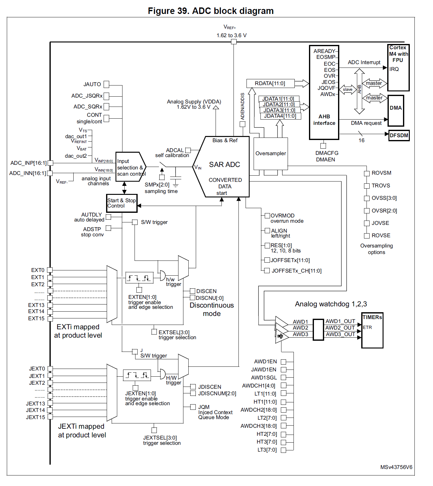

# Lab 3: De thermometer

## Opzet

Het doel van dit labo is om de ADC te leren gebruiken en de mogelijkheden te bekijken van floating point instructies.

## ADC

📌 **RM373**

De microcontroller bevat twee 12-bit ADC's. Deze twee ADC's hebben elk de mogelijkheid om 18 kanalen te bemosteren.

De ADC in de STM32L4 is vrij complex en heeft veel verschillende werkingsmodi.

Zo is de resolutie instelbaar van 6 bits tot 12 bits. De ADC heeft een interne bemonsteringssnelheid van meer dan 4 MSPS bij een resolutie van 12 bits. Voor de lagere resoluties kan dit sneller. 

De ingangen van de ADC kunnen zowel als single ended als differential mode. In single ended mode meet de ADC de spanning ten opzichte van de VSS, in differential mode meet de ADC de spanning ten opzichte van de negatieve input. De ADC heeft ook een interne calibratie die men via software kan oproepen. 

Ingebouw in de ADC is een sequencer, deze zorgt er voor dat automatisch verschillende kanalen achterelkaar worden bemonsterd en weggeschreven. Het gebruik van de sequencer wordt meestal samen met de DMA gebruikt.

In de ADC zijn twee mogelijkheden van conversie mogelijk,
* regular channels, de hoofdsequencer, deze kan via software of een andere trigger, zoals een timer worden gestart.
* injected channels, is een soort van interrupt sequentie. Als deze getriggered is, dan onderbreekt deze de regular channals (als deze op hetzelfde moment aan het bemonsteren zijn) en bemonsterd de ADC dan de injected channels. 

De ADC heeft ook nog een ingebouwde oversamplerer met bijhorende logica. Ook nog heeft deze een inbouwed watchdog waarmee de ADC bijvoorbeeld een PWM timer kan laten stoppen. Die wordt bijvoorbeeld gebruikt wordt als stroommeeting en zonder software men een over-current protection kan inbouwen. 

### Implementatie

Om de ADC te configureren voor basisfunctionaliteit, moeten de volgende stappen ondernomen worden

1. De GPIO pinnen waarop de ADC gaat samplenen configureren in ANALOG MODE
2. De klok naar de ADC aanzetten, en correcte klok selecteren in het CCIPR register 📌**RM234**

		// Klok aanzetten
		RCC->AHB2ENR |= RCC_AHB2ENR_ADCEN; 

		// Klok selecteren, hier gebruiken we sysclk
		RCC->CCIPR &= ~RCC_CCIPR_ADCSEL_Msk;
		RCC->CCIPR |= RCC_CCIPR_ADCSEL_0 | RCC_CCIPR_ADCSEL_1;

3. De ADC uit Deep powerdown mode halen, en de ADC spanning regulator opzetten

		// Deep powerdown modus uitzetten
		ADC1->CR &= ~ADC_CR_DEEPPWD;

		// ADC voltage regulator aanzetten
		ADC1->CR |= ADC_CR_ADVREGEN;

4. Wachten tot dat de regulator gestabilieert is.

		// Delay a few miliseconds, see datasheet for exact timing
		delay_ms(4);

5. De ADC kalibrateren en wachten to deze klaar is.

		// Kalibratie starten
		ADC1->CR |= ADC_CR_ADCAL;
		while(ADC1->CR & ADC_CR_ADCAL);

6. ADC aanzetten en de kanalen configureren. 

		// ADC aanzetten
		ADC1->CR |= ADC_CR_ADEN;

		// kanalen instellen
		ADC1->SMPR1 = ....
		ADC1->SQR1 = ....

Het ontwikkel bordje heeft de volgende mapping. 

| Functie | GPIO | Pin |  ADC Kanaal |
| ------- | ---- | --- | ----------- |
| Potentionmeter | GPIOA | Pin 1 | CH5 |
| NTC weerstand  | GPIOA | Pin 0 | CH6 |
| PA3 connector  | GPIOA | Pin 3 | CH8 |
| PA4 connector | GPIOA | Pin 4 | CH9 |

### ADC meting

Voor een software triggered meeting is het beste dat er maar 1 kanaal is ingesteld in de sequencer. De volgende stappen zijn nodig voor een software triggered meting.

1. Je stelt in het "ADC Sample time register" 📌**RM464** de correcte sample snelheid voor het kanaal. Een hogere bemonstertijd geeft meestal een beter resultaat. Het geeft de interne sample condensator meer tijd om op te laden naar de juiste spanning. Een hogere bemonstertijd geeft ook een lagere beslating aan het meetpunt, maar die limiteerd wel de maximale samplerate
2. In het "ADC regular sequence register" 📌**RM468** stel je in het "length" veld 1 conversie in en selecteer je het kanaal met "SQ1" veld
3. Je zet start hoog in het "ADC CR" register en wacht op de "end-of-sequence" flag in het "ADC ISR" register en wis je de flag

		// Start de ADC en wacht tot de sequentie klaar is
		ADC1->CR |= ADC_CR_ADSTART;
		while(!(ADC1->ISR & ADC_ISR_EOS));

4. Dan lees je de data uit het "ADC data" register" 📌**RM471**

		// Lees de waarde in
		value = ADC1->DR;

## Floating point instructies

    FPU = -mfpu=fpv4-sp-d16
    FLOAT-ABI = -mfloat-abi=hard

    FPU = 
    FLOAT-ABI = -mfloat-abi=soft

## Opdracht

1. Schrijf een C programma dat de temperatuur van de NTC weer geeft op het 7 Segment display in °C met een resolutie van 0.1 °C. In de datasheet van de NTC staan de factoren die je nodig hebt om de conversie te doen van weerstand naar temperatuur.  

2. Compile het programma met en zonder de floating point optie in de Makefile en bespreek kort het verschil tussen de disassembly van deze twee versies. Welke code is het meest efficiënt kwa programma size?

